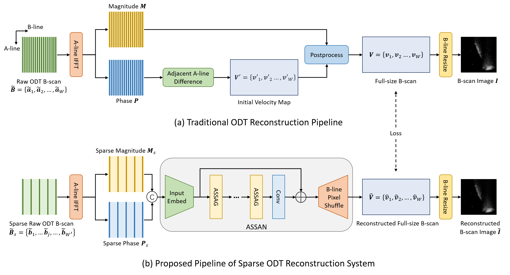
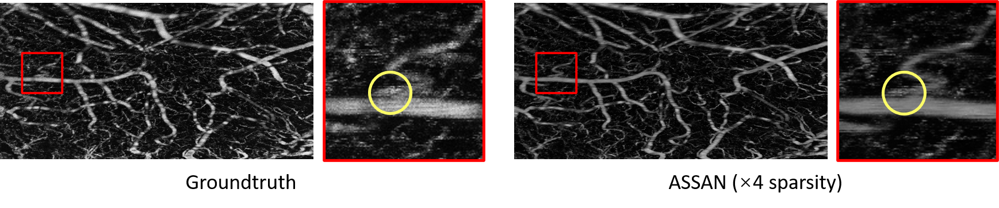

# SOAD

This repo contains the offical PyTroch code for **Sparse Reconstruction of Optical Doppler Tomography with Alternative State Space Model and Attention** @ MICCAI 2025

## Overview


## Result


## Preparation

To bulid the environment：
```
conda env create -f environment.yaml
```

To avoid potential compatibility issue, you may reinstall pytorch and torchvision:

```
pip uninstall torch torchvision torchaudio
pip install torch==2.3.1 torchvision==0.18.1 torchaudio==2.3.1 --index-url https://download.pytorch.org/whl/cu118
```

Checkpoints and example data are available at [data link](https://drive.google.com/drive/folders/1UukU1JyGvZpOvjCq1umU_HyTLp1ZfUP0?usp=sharing). 

For data preparation, simply put the shared data folder and the checkpoint file under the root of this repo. The training data is splited along the width for faster loading.

## Instructions

For training on x2 sparsity:
```
OMP_NUM_THREADS=4 torchrun --nnodes=1 --nproc_per_node=4 odt_train.py --sp 2 --batch-size 2
```

For testing on x2 sparsity:

```
python odt_test.py --sp 2
```

## Acknowledgments

This repo mainly refers to [Mamba](https://github.com/state-spaces/mamba) and [VMamba](https://github.com/MzeroMiko/VMamba) for the implementation of Mamba.

## Citation

```
@inproceedings{li2025sparse,
  title={Sparse Reconstruction of Optical Doppler Tomography with Alternative State Space Model and Attention},
  author={Li, Zhenghong and Ren, Jiaxiang and Cheng, Wensheng and Liu, Yanzuo and Du, Congwu and Pan, Yingtian and Ling, Haibin},
  booktitle={International Conference on Medical Image Computing and Computer-Assisted Intervention},
  year={2025}
}
```